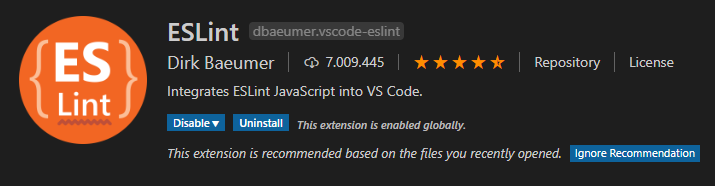

# AngularEslint

This project was generated with [Angular CLI](https://github.com/angular/angular-cli) version 8.3.12.

1. First Delete all TSLint files in the project.

2. Remove TSlint plugin on VSCode.

3. Can use `npm install or yarn add` in this case I use yarn.

4. Uninstall TSLint with `yarn remove eslint`.

5. Run `yarn install eslint -D`.

6. Create file `.eslintrc` and must be clean.

7. We need ESLint compability to Typescript `yarn add @typescript-eslint/eslint-plugin -D` and `yarn add @typescript-eslint/parser - D`.

8. To use the airbn configuration we need:
   `yarn add eslint-plugin-import -D` and `yarn add eslint-config-airbnb-base -D`

9. Now we will install the configuration to integrate Prettier to our project with `yarn add eslint-config-prettier -D`.

10. Finally in our .eslintrc file we copy the following:

`{ "extends": [ "airbnb-base/legacy", "plugin:@typescript-eslint/recommended", "prettier", "prettier/@typescript-eslint" ], "parser": "@typescript-eslint/parser", "parserOptions": { "sourceType": "module" }, "rules": { "@typescript-eslint/no-empty-function": ["error", { "allow": ["constructors"] }] } }`

In order for all the configuration we carry out to take effect we have to verify that we have installed the ESLint plugin in the VSCode, if not, we must install it.



## Optional

You can add the `.eslintignore` file for files where you don't want to apply eslint

You can also add your own `.prettierrc` and `.prettierignore` file for a custom job.

## Not Detect

In case you do not detect the ESLint create a .vscode folder and create the following files:

`settings.json` with this format:

```json
{
  "editor.formatOnSave": true,
  "eslint.autoFixOnSave": true,
  "eslint.validate": [
    {
      "language": "javascript",
      "autoFix": true
    },
    {
      "language": "javascriptreact",
      "autoFix": true
    },
    {
      "language": "typescript",
      "autoFix": true
    },
    {
      "language": "typescriptreact",
      "autoFix": true
    }
  ],
  "tslint.enable": false
}
```

and this file `extensions.json` with:

```json
{
  "recommendations": ["ms-vscode.vscode-typescript-tslint-plugin", "esbenp.prettier-vscode"]
}
```

## Thanks

Likewise all the indicated files will be in the source code, thank you and please give star to the publication.
